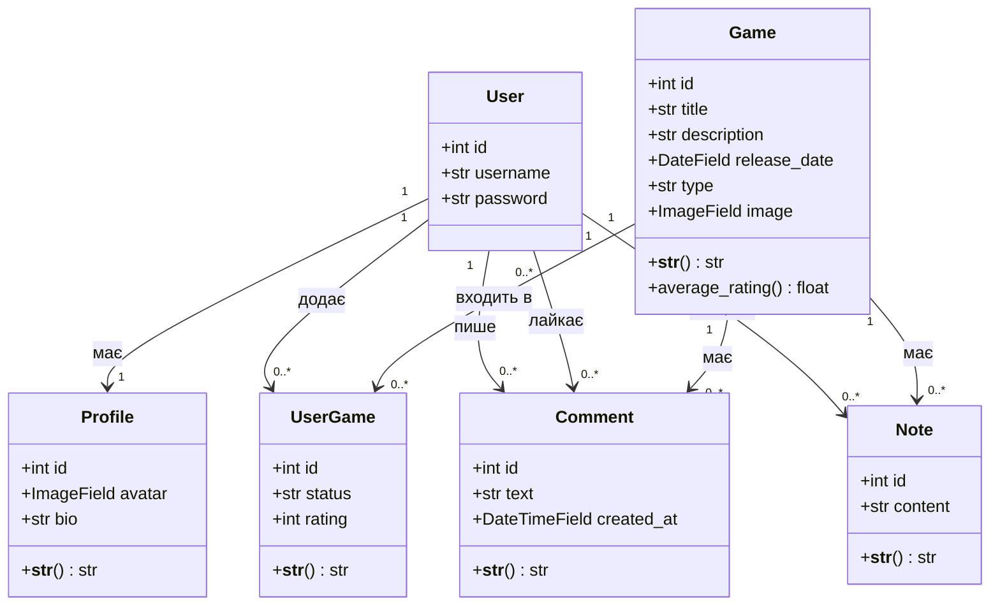
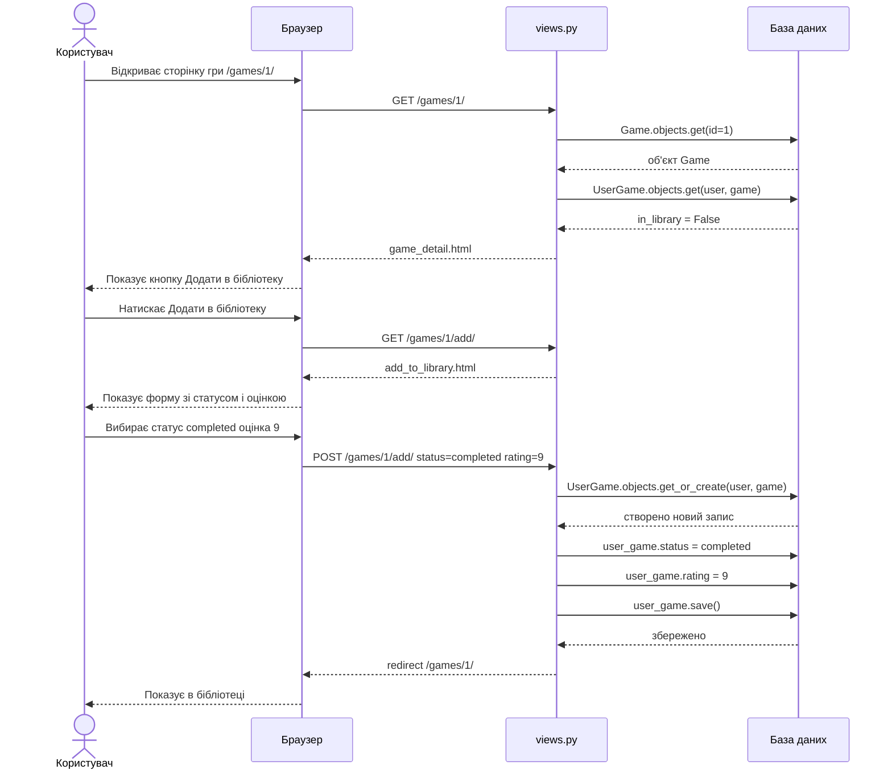

# GameLog

GameLog — це веб-додаток для ведення щоденника геймера з можливістю додавання ігор, відстеження прогресу проходження, оцінювання, коментування та взаємодії між користувачами.

## Функціонал

- Реєстрація та авторизація користувачів
- Перегляд списку ігор (List Page)
- Пошук, фільтрація та сортування
- Детальна сторінка гри (Detail Page)
- Додавання ігор у бібліотеку
- Встановлення статусу (хочу пройти / проходжу / пройшов / кинув)
- Оцінювання ігор
- Коментарі та лайки
- Профіль користувача зі статистикою
- Адмін-панель

## Технології

- Python
- Django
- SQLite
- GitHub

## Документація

- Технічне завдання: `docs/technical_specification.md`

## UML діаграми
### Use Case

```mermaid
graph TD
    User([Користувач])
    Admin([Адміністратор])

    subgraph auth [Авторизація]
        Register[Реєстрація]
        Login[Вхід в систему]
        Logout[Вихід]
    end

    subgraph games [Робота з іграми]
        ViewList[Перегляд списку ігор]
        Search[Пошук за назвою]
        Filter[Фільтрація за типом]
        Sort[Сортування]
        ViewDetail[Перегляд деталей гри]
    end

    subgraph library [Бібліотека]
        AddToLib[Додати гру в бібліотеку]
        SetStatus[Встановити статус]
        SetRating[Виставити оцінку]
    end

    subgraph comments [Коментарі]
        WriteComment[Написати коментар]
        EditComment[Редагувати коментар]
        DeleteComment[Видалити коментар]
        LikeComment[Лайкнути коментар]
    end

    subgraph profile [Профіль]
        ViewProfile[Переглянути профіль]
        ViewStats[Статистика ігор]
    end

    subgraph admin [Адмін-панель]
        ManageGames[Керування іграми]
        ManageUsers[Керування користувачами]
        ModerateComments[Модерація коментарів]
    end

    User --> Register
    User --> Login
    User --> Logout
    User --> ViewList
    User --> Search
    User --> Filter
    User --> Sort
    User --> ViewDetail
    User --> AddToLib
    User --> SetStatus
    User --> SetRating
    User --> WriteComment
    User --> EditComment
    User --> DeleteComment
    User --> LikeComment
    User --> ViewProfile
    User --> ViewStats

    Admin --> ManageGames
    Admin --> ManageUsers
    Admin --> ModerateComments
    Admin --> Login
```

### Class Diagram

### Sequence Diagram

## Команда

- Ільчук  
- Дорощенков  
- Пахольчук  